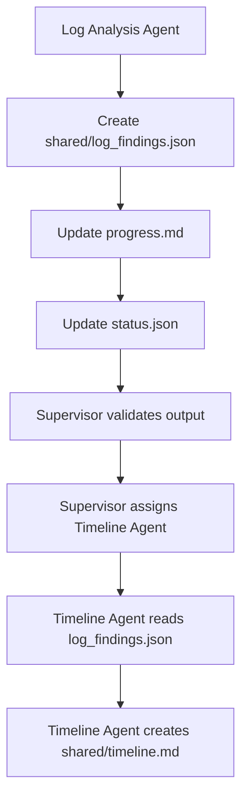

# AI-Agent-DFIR-Hospital
Dưới đây là bản hướng dẫn chi tiết để dùng **Roo Code trong VS Code** làm “hệ điều phối bệnh viện điều tra số” cho **AI Agent DFIR Hospital**.

Roo Code phù hợp vì extension này chạy trực tiếp trong VS Code, có các mode như **Code, Ask, Architect, Debug, Orchestrator**, hỗ trợ nhóm tool gồm **read, edit, command, mcp**, và có cơ chế **Orchestrator mode / mode switching** để điều phối tác vụ nhiều bước. ([Visual Studio Marketplace][1])

---

# PHẦN 1 — KIẾN TRÚC MỤC TIÊU

## 1.1 Ánh xạ mô hình bệnh viện

| Thành phần             | Vai trò trong DFIR Hospital        |
| ---------------------- | ---------------------------------- |
| VS Code                | Bệnh viện điều tra số              |
| Roo Code               | Hệ điều phối AI Agent              |
| Roo Orchestrator Mode  | Supervisor Agent / Chief Doctor    |
| Roo Custom Mode        | Specialist Agent                   |
| `workflow.md`          | Quy trình khám/chẩn đoán           |
| `todo.md`              | Danh sách công việc                |
| `progress.md`          | Hồ sơ theo dõi tiến độ             |
| `status.json`          | Trạng thái máy đọc được            |
| `shared/`              | Khu vực bàn giao kết quả chuẩn hóa |
| `agents/<agent_name>/` | Workspace riêng từng Agent         |
| `evidence/`            | Kho chứng cứ gốc                   |
| `tools/`               | Công cụ xét nghiệm                 |
| `reports/`             | Phòng trả kết quả                  |

## 1.2 Nguyên tắc vận hành

Supervisor Agent không trực tiếp phân tích log hay viết báo cáo. Supervisor chỉ:

* đọc `workflow.md`;
* tạo task trong `todo.md`;
* theo dõi `progress.md`;
* cập nhật `status.json`;
* giao việc cho Specialist Agent;
* kiểm tra output;
* quyết định handoff sang Agent tiếp theo.

Specialist Agent chỉ làm đúng chuyên môn:

* Intake Agent đọc báo cáo ban đầu;
* Triage Agent phân loại sự cố;
* Log Analysis Agent phân tích log;
* Timeline Agent dựng timeline;
* Report Agent viết báo cáo.

Private workspace giúp tránh Agent ghi đè lẫn nhau. Shared workspace chỉ chứa output đã chuẩn hóa để Agent khác đọc tiếp.

---

# PHẦN 2 — CÀI ĐẶT VS CODE + ROO CODE

## 2.1 Cài VS Code

1. Tải và cài **Visual Studio Code Stable**.
2. Mở VS Code.
3. Vào:

```text
Help → About
```

4. Kiểm tra VS Code đã chạy ổn định.

## 2.2 Cài Roo Code

1. Mở VS Code.
2. Nhấn:

```text
Ctrl + Shift + X
```

3. Tìm:

```text
Roo Code
```

4. Chọn extension **Roo Code**.
5. Bấm **Install**.
6. Sau khi cài, Roo Code sẽ xuất hiện ở sidebar VS Code. Marketplace mô tả Roo Code như một “AI dev team of agents” trong editor. ([Visual Studio Marketplace][1])

## 2.3 Cấu hình model API cơ bản

Trong Roo Code sidebar:

1. Mở Roo Code.
2. Chọn phần **Settings** hoặc **Provider/API Configuration**.
3. Chọn provider model API bạn dùng.
4. Nhập API key.
5. Chọn model mặc định cho Roo.

Ví dụ cấu hình tư duy:

| Mode         | Model dùng sau này   |
| ------------ | -------------------- |
| Orchestrator | model reasoning mạnh |
| Intake       | model nhanh          |
| Triage       | model reasoning      |
| Log Analysis | model context dài    |
| Report       | model viết tốt       |


## 2.4 Bật filesystem và terminal/tool access

Trong Roo Settings, "auto-approve" nên bật hoặc cho phép có kiểm soát:

```text
Read files: enabled
Edit files: enabled with approval
Run commands: enabled with approval
Browser/MCP: optional
```

Khuyến nghị cho DFIR:

| Quyền                  | Khuyến nghị                |
| ---------------------- | -------------------------- |
| Read file              | Cho phép                   |
| Edit file              | Cho phép nhưng review diff |
| Run terminal           | Luôn yêu cầu approval      |
| Auto-approve command   | Tắt ở MVP                  |
| Auto-approve file edit | Tắt ở MVP                  |
| MCP                    | Chỉ bật khi cần            |

Lý do: DFIR cần bảo vệ evidence, không để Agent tự chạy lệnh phá hủy hoặc upload dữ liệu.

---

# PHẦN 3 — TẠO DFIR WORKSPACE

## 3.1 Tạo folder dự án

Trong terminal:

```bash
mkdir dfir-agent-workstation
cd dfir-agent-workstation
```

Hoặc tạo bằng VS Code:

```text
File → Open Folder → New Folder → dfir-agent-workstation
```

## 3.2 Tạo cấu trúc thư mục

Trong VS Code Terminal:

```bash
mkdir -p cases/CASE-001/shared
mkdir -p cases/CASE-001/evidence
mkdir -p cases/CASE-001/analysis
mkdir -p cases/CASE-001/reports
mkdir -p cases/CASE-001/audit

mkdir -p cases/CASE-001/agents/supervisor_agent
mkdir -p cases/CASE-001/agents/intake_agent
mkdir -p cases/CASE-001/agents/triage_agent
mkdir -p cases/CASE-001/agents/log_analysis_agent
mkdir -p cases/CASE-001/agents/timeline_agent
mkdir -p cases/CASE-001/agents/report_agent

mkdir -p agents
mkdir -p tools
mkdir -p configs
```

Windows PowerShell:

```powershell
mkdir cases
mkdir cases\CASE-001
mkdir cases\CASE-001\shared
mkdir cases\CASE-001\evidence
mkdir cases\CASE-001\analysis
mkdir cases\CASE-001\reports
mkdir cases\CASE-001\audit

mkdir cases\CASE-001\agents
mkdir cases\CASE-001\agents\supervisor_agent
mkdir cases\CASE-001\agents\intake_agent
mkdir cases\CASE-001\agents\triage_agent
mkdir cases\CASE-001\agents\log_analysis_agent
mkdir cases\CASE-001\agents\timeline_agent
mkdir cases\CASE-001\agents\report_agent

mkdir tools
```

## 3.3 Cấu trúc chuẩn

```text
dfir-agent-workstation/
├── cases/
│   └── CASE-001/
│       ├── workflow.md
│       ├── todo.md
│       ├── progress.md
│       ├── status.json
│       ├── shared/
│       ├── evidence/
│       ├── analysis/
│       ├── reports/
│       ├── audit/
│       └── agents/
│           ├── supervisor_agent/
│           ├── intake_agent/
│           ├── triage_agent/
│           ├── log_analysis_agent/
│           ├── timeline_agent/
│           └── report_agent/
├── tools/
│   ├── parse_eventlog.py
│   ├── generate_timeline.py
│   └── write_audit_log.py
```

---

# PHẦN 4 — TẠO AGENT TRONG ROO

Trong Roo, cách thực tế nhất là dùng **Custom Modes** để mô phỏng từng Agent. Roo có cơ chế mode chuyên biệt và custom mode/file restriction, phù hợp để tạo persona và giới hạn hành vi theo vai trò. ([Roocode Inc.][2])

## 4.1 Cách tạo Custom Mode

Trong Roo sidebar:

```text
Roo Code → Modes → Manage / Create Custom Mode
```

Tạo từng mode:

```text
DFIR Supervisor
DFIR Intake
DFIR Triage
DFIR Log Analysis
DFIR Timeline
DFIR Report
```

Nếu giao diện Roo thay đổi theo phiên bản, dùng cách thay thế:

```text
Roo Code Settings → Custom Modes → Add Mode
```

## 4.2 Supervisor Agent

### Vai trò

* Đọc `workflow.md`.
* Tạo/cập nhật `todo.md`.
* Cập nhật `progress.md`.
* Cập nhật `status.json`.
* Điều phối task.
* Không trực tiếp phân tích evidence.

### Tool quyền

| Tool group | Cho phép               |
| ---------- | ---------------------- |
| read       | Có                     |
| edit       | Có, với tracking files |
| command    | Hạn chế                |
| mcp        | Không cần ở MVP        |

### System prompt mẫu

```text
Bạn là DFIR Supervisor Agent, đóng vai Chief Doctor trong hệ thống AI Agent DFIR Hospital.

Nhiệm vụ:
- Đọc workflow.md.
- Tạo và cập nhật todo.md, progress.md, status.json.
- Giao task cho Specialist Agent theo đúng workflow.
- Kiểm tra output của Agent trước khi handoff.
- Không trực tiếp phân tích log, malware, timeline hoặc viết báo cáo.
- Không sửa evidence gốc.
- Không ghi vào workspace riêng của Agent khác.
- Chỉ ghi vào:
  - cases/CASE-001/agents/supervisor_agent/
  - cases/CASE-001/todo.md
  - cases/CASE-001/progress.md
  - cases/CASE-001/status.json
  - cases/CASE-001/audit/
```

## 4.3 Intake Agent

```text
Bạn là DFIR Intake Agent.

Nhiệm vụ:
- Đọc user_report.md.
- Tóm tắt thông tin ban đầu.
- Xác định phạm vi sơ bộ.
- Ghi kết quả riêng vào agents/intake_agent/.
- Xuất bản chuẩn hóa sang shared/case_summary.md.
- Không phân tích log chi tiết.
- Không sửa evidence gốc.
```

## 4.4 Triage Agent

```text
Bạn là DFIR Triage Agent.

Nhiệm vụ:
- Đọc shared/case_summary.md.
- Phân loại sự cố.
- Đánh giá severity, confidence.
- Đề xuất bước phân tích tiếp theo.
- Ghi nháp vào agents/triage_agent/.
- Xuất kết quả chuẩn hóa sang shared/triage_result.json.
```

## 4.5 Log Analysis Agent

```text
Bạn là DFIR Log Analysis Agent.

Nhiệm vụ:
- Chỉ phân tích log được chỉ định.
- Đọc evidence/sample_windows_events.json và evidence/sample_sysmon.log.
- Có thể gọi tool parse_eventlog.py nếu được yêu cầu.
- Ghi phân tích trung gian vào agents/log_analysis_agent/.
- Xuất findings chuẩn hóa sang shared/log_findings.json.
- Không sửa evidence gốc.
- Không ghi vào workspace của Agent khác.
```

## 4.6 Timeline Agent

```text
Bạn là DFIR Timeline Agent.

Nhiệm vụ:
- Đọc shared/log_findings.json.
- Tạo timeline điều tra.
- Ghi trung gian vào agents/timeline_agent/.
- Xuất timeline chuẩn hóa sang shared/timeline.md.
- Không sửa finding gốc; nếu cần chỉnh, tạo version mới.
```

## 4.7 Report Agent

```text
Bạn là DFIR Report Agent.

Nhiệm vụ:
- Đọc shared/case_summary.md, shared/triage_result.json, shared/log_findings.json, shared/timeline.md.
- Tạo báo cáo sơ bộ tại reports/preliminary_report.md.
- Không sửa evidence, không sửa finding của Agent khác.
- Phân biệt rõ fact, inference, recommendation.
```

---

# PHẦN 5 — WORKFLOW ĐIỀU PHỐI QUA MARKDOWN

Tạo file:

```text
cases/CASE-001/workflow.md
```

Nội dung:

```markdown
# CASE-001 DFIR Workflow

## Case Objective

Investigate suspicious PowerShell execution and unusual login activity on HOST-001.

## Global Rules

- Evidence is immutable.
- Each Agent writes only to its own private workspace.
- Shared folder contains normalized outputs only.
- Every task must update progress.md and status.json.
- Every important action must be logged to audit/agent_activity.log.
- Human approval required before external API calls or destructive commands.

## Agents

| Agent | Role |
|---|---|
| Supervisor Agent | Workflow orchestration |
| Intake Agent | Initial case summary |
| Triage Agent | Incident classification |
| Log Analysis Agent | Windows/Sysmon log analysis |
| Timeline Agent | Timeline reconstruction |
| Report Agent | Preliminary report |

## Workflow Steps

### TASK-001 — Intake

Agent: Intake Agent

Input:
- cases/CASE-001/evidence/user_report.md

Private Workspace:
- cases/CASE-001/agents/intake_agent/

Output:
- cases/CASE-001/shared/case_summary.md

Completion Criteria:
- Case summary includes affected host, user, symptoms, initial questions.

Next:
- TASK-002

---

### TASK-002 — Triage

Agent: Triage Agent

Input:
- cases/CASE-001/shared/case_summary.md

Private Workspace:
- cases/CASE-001/agents/triage_agent/

Output:
- cases/CASE-001/shared/triage_result.json

Completion Criteria:
- Valid JSON.
- Includes incident_type, severity, confidence, recommended_next_steps.

Next:
- TASK-003

---

### TASK-003 — Log Analysis

Agent: Log Analysis Agent

Input:
- cases/CASE-001/evidence/sample_windows_events.json
- cases/CASE-001/evidence/sample_sysmon.log

Private Workspace:
- cases/CASE-001/agents/log_analysis_agent/

Output:
- cases/CASE-001/shared/log_findings.json

Allowed Tools:
- tools/parse_eventlog.py

Completion Criteria:
- Valid JSON.
- Includes suspicious events, IOCs, MITRE mapping if possible.

Next:
- TASK-004

---

### TASK-004 — Timeline

Agent: Timeline Agent

Input:
- cases/CASE-001/shared/log_findings.json

Private Workspace:
- cases/CASE-001/agents/timeline_agent/

Output:
- cases/CASE-001/shared/timeline.md

Completion Criteria:
- Timeline sorted by timestamp.
- Each event references source evidence.

Next:
- TASK-005

---

### TASK-005 — Report

Agent: Report Agent

Input:
- cases/CASE-001/shared/case_summary.md
- cases/CASE-001/shared/triage_result.json
- cases/CASE-001/shared/log_findings.json
- cases/CASE-001/shared/timeline.md

Private Workspace:
- cases/CASE-001/agents/report_agent/

Output:
- cases/CASE-001/reports/preliminary_report.md

Completion Criteria:
- Report includes summary, scope, findings, timeline, recommendation.
```

Cách Roo dùng workflow:

1. Bạn mở Roo ở **Orchestrator Mode**.
2. Prompt Supervisor đọc `workflow.md`.
3. Supervisor tạo task tracking.
4. Bạn chuyển sang custom mode tương ứng hoặc yêu cầu Roo dùng `switch_mode` khi cần. Roo có tool `switch_mode` để đổi mode theo chuyên môn. ([Roo Code Docs][3])

---

# PHẦN 6 — TASK TRACKING & PROGRESS TRACKING

## 6.1 Tạo `todo.md`

```markdown
# CASE-001 Todo

| Task ID | Agent | Status | Input | Output | Next | Notes |
|---|---|---|---|---|---|---|
| TASK-001 | Intake Agent | pending | evidence/user_report.md | shared/case_summary.md | TASK-002 | |
| TASK-002 | Triage Agent | pending | shared/case_summary.md | shared/triage_result.json | TASK-003 | |
| TASK-003 | Log Analysis Agent | pending | evidence/sample_windows_events.json, evidence/sample_sysmon.log | shared/log_findings.json | TASK-004 | |
| TASK-004 | Timeline Agent | pending | shared/log_findings.json | shared/timeline.md | TASK-005 | |
| TASK-005 | Report Agent | pending | shared/*.md/json | reports/preliminary_report.md | done | |
```

## 6.2 Tạo `progress.md`

```markdown
# CASE-001 Progress Log

## Status Legend

- pending
- running
- blocked
- completed
- failed

---

## TASK-001 — Intake

Status: pending  
Agent: Intake Agent  
Started:  
Completed:  
Input: evidence/user_report.md  
Output: shared/case_summary.md  
Summary:  
Issues:  
Next: TASK-002
```

## 6.3 Tạo `status.json`

```json
{
  "case_id": "CASE-001",
  "overall_status": "initialized",
  "current_task": null,
  "active_agent": null,
  "tasks": {
    "TASK-001": {
      "agent": "intake_agent",
      "status": "pending",
      "input": ["cases/CASE-001/evidence/user_report.md"],
      "output": ["cases/CASE-001/shared/case_summary.md"]
    },
    "TASK-002": {
      "agent": "triage_agent",
      "status": "pending",
      "input": ["cases/CASE-001/shared/case_summary.md"],
      "output": ["cases/CASE-001/shared/triage_result.json"]
    }
  }
}
```

`progress.md` dễ đọc cho con người. `status.json` dễ parse cho Agent, script hoặc orchestration layer.

---

# PHẦN 7 — SHARED VS PRIVATE WORKSPACE

## 7.1 Quy tắc bắt buộc

| Khu vực           | Ai được ghi                | Mục đích                   |
| ----------------- | -------------------------- | -------------------------- |
| `evidence/`       | Không Agent nào tự sửa     | Evidence gốc               |
| `agents/<agent>/` | Agent tương ứng            | Nháp, phân tích trung gian |
| `shared/`         | Agent được giao task       | Output chuẩn hóa           |
| `reports/`        | Report Agent               | Báo cáo                    |
| `audit/`          | Supervisor hoặc audit tool | Log hoạt động              |

## 7.2 Versioning output

Không ghi đè file quan trọng. Dùng version:

```text
shared/log_findings_v001.json
shared/log_findings_v002.json
shared/timeline_v001.md
reports/preliminary_report_v001.md
```

Có thể tạo symlink hoặc file pointer:

```text
shared/log_findings_latest.json
```

Nhưng MVP nên dùng version rõ ràng.

## 7.3 Audit activity

Mỗi Agent ghi:

```text
timestamp | agent | action | input | output | tool | status
```

Ví dụ:

```text
2026-05-21T10:15:00+07:00 | log_analysis_agent | created finding | evidence/sample_windows_events.json | shared/log_findings.json | parse_eventlog.py | completed
```

---

# PHẦN 8 — TOOL CALLING TRONG ROO

Roo có nhóm tool `command` để chạy terminal command, nên có thể gọi Python/PowerShell/Bash nếu bạn cấp quyền. ([Roocode Inc.][2])

## 8.1 Tạo `parse_eventlog.py`

File:

```text
tools/parse_eventlog.py
```

Nội dung:

```python
import json
import sys
from datetime import datetime, timezone

input_path = sys.argv[1]
output_path = sys.argv[2]

with open(input_path, "r", encoding="utf-8") as f:
    event = json.load(f)

findings = {
    "finding_id": "FND-LOG-001",
    "created_at": datetime.now(timezone.utc).isoformat(),
    "source_file": input_path,
    "severity": "high" if "powershell" in event.get("process", "").lower() else "low",
    "title": "Suspicious PowerShell execution",
    "description": "PowerShell process execution observed.",
    "observables": {
        "process": event.get("process"),
        "command_line": event.get("command_line"),
        "user": event.get("user")
    },
    "mitre": [
        {
            "tactic": "Execution",
            "technique": "T1059.001",
            "name": "PowerShell"
        }
    ]
}

with open(output_path, "w", encoding="utf-8") as f:
    json.dump(findings, f, indent=2)

print(f"Wrote findings to {output_path}")
```

## 8.2 Tạo `generate_timeline.py`

```python
import json
import sys
from datetime import datetime, timezone

input_path = sys.argv[1]
output_path = sys.argv[2]

with open(input_path, "r", encoding="utf-8") as f:
    finding = json.load(f)

timeline = f"""# Timeline

| Time | Event | Source | Severity |
|---|---|---|---|
| {datetime.now(timezone.utc).isoformat()} | {finding.get("title")} | {finding.get("source_file")} | {finding.get("severity")} |

## Notes

{finding.get("description")}
"""

with open(output_path, "w", encoding="utf-8") as f:
    f.write(timeline)

print(f"Wrote timeline to {output_path}")
```

## 8.3 Tạo `write_audit_log.py`

```python
import sys
from datetime import datetime, timezone

log_path, agent, action, status = sys.argv[1], sys.argv[2], sys.argv[3], sys.argv[4]

line = f"{datetime.now(timezone.utc).isoformat()} | {agent} | {action} | {status}\n"

with open(log_path, "a", encoding="utf-8") as f:
    f.write(line)

print(line)
```

## 8.4 Prompt Roo gọi tool

Trong Roo Log Analysis mode:

```text
Bạn là Log Analysis Agent.

Task:
- Đọc cases/CASE-001/evidence/sample_windows_events.json
- Chạy tool:
  python tools/parse_eventlog.py cases/CASE-001/evidence/sample_windows_events.json cases/CASE-001/shared/log_findings.json

Yêu cầu:
- Không sửa evidence gốc.
- Ghi phân tích trung gian vào cases/CASE-001/agents/log_analysis_agent/notes.md.
- Cập nhật cases/CASE-001/progress.md.
- Cập nhật cases/CASE-001/status.json.
- Ghi audit vào cases/CASE-001/audit/agent_activity.log bằng tools/write_audit_log.py.
```

Khi Roo đề xuất command, bạn review rồi approve.

---

# PHẦN 9 — AGENT HANDOFF

## 9.1 Flow chuẩn



## 9.2 Handoff JSON

Tạo file:

```text
cases/CASE-001/shared/handoff_LOG_TO_TIMELINE.json
```

```json
{
  "handoff_id": "HANDOFF-LOG-TIMELINE-001",
  "from_agent": "log_analysis_agent",
  "to_agent": "timeline_agent",
  "status": "ready",
  "input_for_next_agent": [
    "cases/CASE-001/shared/log_findings.json"
  ],
  "required_output": [
    "cases/CASE-001/shared/timeline.md"
  ],
  "validation": {
    "schema_valid": true,
    "reviewed_by": "supervisor_agent"
  }
}
```

## 9.3 Prompt Supervisor validate handoff

```text
Bạn là Supervisor Agent.

Hãy kiểm tra:
- cases/CASE-001/shared/log_findings.json
- cases/CASE-001/shared/handoff_LOG_TO_TIMELINE.json

Nếu output hợp lệ:
- cập nhật TASK-003 = completed
- cập nhật TASK-004 = running
- giao task cho Timeline Agent

Nếu output thiếu field:
- đánh dấu TASK-003 = blocked
- ghi lý do vào progress.md
```

---

# PHẦN 10 — DFIR MINI DEMO

## 10.1 Tạo input mẫu

File:

```text
cases/CASE-001/evidence/user_report.md
```

```markdown
# User Report

User user01 reported suspicious PowerShell popup on HOST-001.
The SOC also observed unusual login activity around 09:15.
```

File:

```text
cases/CASE-001/evidence/sample_windows_events.json
```

```json
{
  "timestamp": "2026-05-21T09:17:00+07:00",
  "event_id": 4688,
  "host": "HOST-001",
  "user": "user01",
  "process": "powershell.exe",
  "command_line": "powershell.exe -NoProfile -ExecutionPolicy Bypass -EncodedCommand SQBFAFgA"
}
```

File:

```text
cases/CASE-001/evidence/sample_sysmon.log
```

```text
2026-05-21T09:17:00+07:00 HOST-001 Sysmon EventID=1 ProcessCreate Image=powershell.exe CommandLine="-EncodedCommand SQBFAFgA" User=user01
```

## 10.2 Chạy bước 1 — Supervisor khởi tạo

Trong Roo Orchestrator Mode, nhập:

```text
Bạn là DFIR Supervisor Agent.

Hãy đọc:
cases/CASE-001/workflow.md

Sau đó:
1. Tạo hoặc cập nhật cases/CASE-001/todo.md
2. Tạo hoặc cập nhật cases/CASE-001/progress.md
3. Tạo hoặc cập nhật cases/CASE-001/status.json
4. Không sửa evidence gốc
5. Không phân tích log trực tiếp
6. Ghi audit vào cases/CASE-001/audit/agent_activity.log
```

Expected:

```text
todo.md updated
progress.md initialized
status.json initialized
audit/agent_activity.log updated
```

## 10.3 Chạy bước 2 — Intake Agent

Chuyển Roo sang custom mode **DFIR Intake** hoặc yêu cầu Roo switch mode.

Prompt:

```text
Bạn là Intake Agent.

Nhận TASK-001 từ cases/CASE-001/todo.md.

Đọc:
cases/CASE-001/evidence/user_report.md

Ghi nháp vào:
cases/CASE-001/agents/intake_agent/intake_notes.md

Xuất kết quả chuẩn hóa:
cases/CASE-001/shared/case_summary.md

Cập nhật:
cases/CASE-001/progress.md
cases/CASE-001/status.json

Không sửa evidence gốc.
```

Expected `shared/case_summary.md`:

```markdown
# Case Summary

Case: CASE-001  
Affected Host: HOST-001  
Affected User: user01  
Symptoms:
- Suspicious PowerShell popup
- Unusual login activity

Initial Hypothesis:
- Possible suspicious script execution
- Possible compromised user account
```

## 10.4 Chạy bước 3 — Triage Agent

Prompt:

```text
Bạn là Triage Agent.

Nhận TASK-002.

Đọc:
cases/CASE-001/shared/case_summary.md

Xuất:
cases/CASE-001/shared/triage_result.json

Schema bắt buộc:
{
  "case_id": "...",
  "incident_type": "...",
  "severity": "...",
  "confidence": 0.0,
  "recommended_next_steps": []
}

Cập nhật progress.md và status.json.
```

Expected:

```json
{
  "case_id": "CASE-001",
  "incident_type": "suspicious_powershell_execution",
  "severity": "high",
  "confidence": 0.8,
  "recommended_next_steps": [
    "analyze_windows_event_log",
    "analyze_sysmon_log",
    "build_timeline"
  ]
}
```

## 10.5 Chạy bước 4 — Log Analysis Agent

Prompt:

```text
Bạn là Log Analysis Agent.

Nhận TASK-003.

Đọc:
cases/CASE-001/evidence/sample_windows_events.json
cases/CASE-001/evidence/sample_sysmon.log

Chạy tool nếu cần:
python tools/parse_eventlog.py cases/CASE-001/evidence/sample_windows_events.json cases/CASE-001/shared/log_findings.json

Ghi nháp:
cases/CASE-001/agents/log_analysis_agent/analysis_notes.md

Output chuẩn hóa:
cases/CASE-001/shared/log_findings.json

Không sửa evidence gốc.
Không ghi vào workspace Agent khác.
Cập nhật progress.md, status.json và audit log.
```

## 10.6 Chạy bước 5 — Timeline Agent

Prompt:

```text
Bạn là Timeline Agent.

Nhận TASK-004.

Đọc:
cases/CASE-001/shared/log_findings.json

Tạo:
cases/CASE-001/shared/timeline.md

Có thể chạy:
python tools/generate_timeline.py cases/CASE-001/shared/log_findings.json cases/CASE-001/shared/timeline.md

Cập nhật progress.md, status.json và audit log.
```

## 10.7 Chạy bước 6 — Report Agent

Prompt:

```text
Bạn là Report Agent.

Nhận TASK-005.

Đọc:
cases/CASE-001/shared/case_summary.md
cases/CASE-001/shared/triage_result.json
cases/CASE-001/shared/log_findings.json
cases/CASE-001/shared/timeline.md

Tạo:
cases/CASE-001/reports/preliminary_report.md

Báo cáo phải gồm:
- Executive summary
- Scope
- Evidence reviewed
- Findings
- Timeline
- Initial assessment
- Recommended next steps

Không sửa evidence gốc.
Không sửa output Agent khác.
```

---

# PHẦN 11 — BEST PRACTICES

## 11.1 Workflow Markdown convention

Mỗi task nên có đủ:

```text
Task ID
Agent
Input
Private Workspace
Output
Allowed Tools
Completion Criteria
Next Task
Human Approval
```

## 11.2 File naming convention

```text
<artifact_type>_<agent>_v001.<ext>
```

Ví dụ:

```text
log_findings_log_analysis_agent_v001.json
timeline_timeline_agent_v001.md
preliminary_report_report_agent_v001.md
```

## 11.3 Output schema convention

Mọi JSON output nên có:

```json
{
  "case_id": "CASE-001",
  "agent": "log_analysis_agent",
  "created_at": "ISO-8601",
  "input_files": [],
  "output_type": "finding",
  "confidence": 0.0,
  "data": {}
}
```

## 11.4 Evidence immutable

Không Agent nào được:

* sửa file trong `evidence/`;
* xóa evidence;
* đổi tên evidence;
* upload evidence ra ngoài;
* ghi output phân tích vào folder evidence.

## 11.5 Human approval

Bắt buộc approval trước khi:

* chạy tool destructive;
* gọi API bên ngoài;
* upload hash/file;
* xóa file;
* nén hoặc di chuyển evidence;
* chạy script chưa được review.

## 11.6 Context size management

Không nạp toàn bộ evidence lớn vào Roo. Dùng:

* summary file;
* extracted findings;
* JSON normalized output;
* chunking;
* tool parser;
* timeline intermediate file.

---

# PHẦN 12 — KẾT LUẬN

## Stack Roo MVP

```text
VS Code
+ Roo Code
+ Custom Modes
+ Markdown workflow
+ File-based task tracking
+ Python tool wrappers
+ Shared/private workspace
```

## Stack production workstation

```text
VS Code
+ Roo Code
+ Custom Modes
+ strict permissions
+ signed audit log
+ tool wrapper layer
+ schema validator
+ report generator
+ optional MCP/tool server
```

## Limitation của Roo

* Không phải SOAR chuyên dụng.
* Folder permission chủ yếu dựa vào prompt/config, chưa thay thế OS-level ACL.
* Multi-agent cần discipline trong workflow và handoff.
* Với case lớn, cần chunking và tool parser.
* Cần review command trước khi chạy.

## Workaround

* Dùng `permissions.yaml`.
* Dùng workspace riêng cho từng Agent.
* Dùng script validate schema.
* Dùng Git để audit thay đổi file.
* Dùng OS permission/read-only cho `evidence/`.
* Dùng human approval cho command/API.

## Khi nào cần custom orchestration layer

Cần nâng cấp ngoài Roo nếu:

* muốn chạy nhiều Agent song song thật;
* cần queue/retry tự động;
* cần RBAC nghiêm ngặt;
* cần tích hợp SIEM/EDR/SOAR production;
* cần signed chain of custody;
* cần workflow engine như Temporal, LangGraph hoặc Airflow.

Kết luận: với MVP và pilot, **VS Code + Roo Code + file-based orchestration** là đủ để dựng “DFIR Hospital Workstation” thực chiến. Khi quy mô tăng, Roo nên đóng vai trò IDE/agent interface, còn orchestration lõi nên chuyển dần sang workflow engine chuyên dụng.

[1]: https://marketplace.visualstudio.com/items?itemName=RooVeterinaryInc.roo-cline&utm_source=chatgpt.com "Roo Code - Visual Studio Marketplace"
[2]: https://roocodeinc.github.io/Roo-Code/basic-usage/using-modes/?utm_source=chatgpt.com "Using Modes | Roo Code Documentation"
[3]: https://docs.roocode.com/advanced-usage/available-tools/switch-mode?utm_source=chatgpt.com "switch_mode | Roo Code Documentation"
